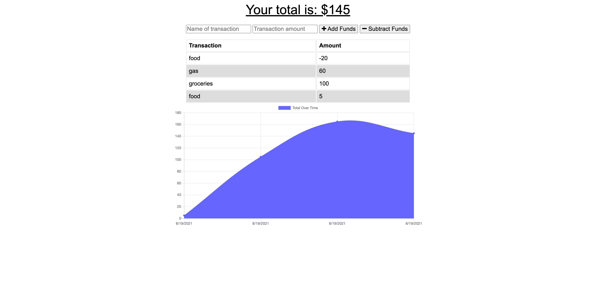

# Budget-Tracker

## **Description**
This project updated an existing budget tracker application to allow for offline access and functionality. The user can add expenses and deposits to their budget with or without a connection. If the user enters transactions offline, the transaction will be updated when they're brought back online.

## **Table of Contents**
* [Installation](#installation)
* [Usage](#usage)
* [Contributions](#contributions)
* [Licenses](#licenses)
* [Badges](#Badges)
* [Questions](#questions)

### **Installation**
install dependencies:

npm
mongoose
express

to instal dependencies => run the following command: npm i, npm i express, npm i mongoose

### **Usage**

Access site: https://budget-trackerjl.herokuapp.com/

### **Technologies Used:**
* PWA
* JavaScript
* npm
* MongoDB
* Mongoose

### *Contributions*

### *Licenses*
MIT license

### *Badges*

### *Questions*
If you have any questions, reach out to me on Git Hub https://github.com/JJLindsey, or send me a message jlindsey010@gmail.com.

©Jennifer Lindsey 2021